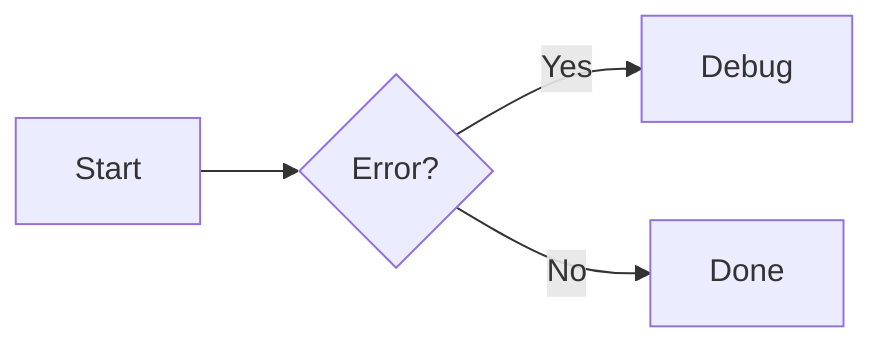

# Zensical Documentation Authoring Reference

This workflow is a **complete reference** for writing documentation using Zensical.
All syntax examples below are ready to use in the project's `docs/` directory.
The full upstream docs live in `zensical_docs/docs/authoring/`.

> **Config file:** `zensical.toml` (TOML format, not `mkdocs.yml`).
> **Serve locally:** `uv run zensical serve`
> **Build:** `uv run zensical build --clean`

---

## 1. Front Matter

Every page should start with front matter (YAML syntax between `---` fences):

```markdown
---
icon: lucide/braces # Nav icon (any bundled icon set)
title: My Page Title # Overrides nav + <title>
description: A brief summary # Goes into <meta> for SEO
status: new # "new" or "deprecated" badges in nav
hide:
    - navigation # Hide left sidebar
    - toc # Hide right TOC
---
```

Built-in status identifiers: `new` (🔔), `deprecated` (🗑️).
Custom statuses need a matching entry in `zensical.toml`:

```toml
[project.extra.status]
beta = "Beta feature"
```

---

## 2. Admonitions (Call-outs)

Admonitions start with `!!!`, followed by a type keyword.

### Basic

```markdown
!!! note "Optional custom title"

    Content indented by 4 spaces.
```

### Collapsible (closed / open)

```markdown
??? tip "Click to expand"

    Hidden by default.

???+ warning "Expanded by default"

    Visible on load.
```

### Inline (sidebar-like)

```markdown
!!! info inline end "Sidebar note"

    Floats to the right of the next content block.
```

Use `inline` (left) or `inline end` (right). Must appear **before** adjacent content.

### Supported types

| Type       | Aliases                |
| ---------- | ---------------------- |
| `note`     | `seealso`              |
| `abstract` | `summary`, `tldr`      |
| `info`     | `todo`                 |
| `tip`      | `hint`, `important`    |
| `success`  | `check`, `done`        |
| `question` | `help`, `faq`          |
| `warning`  | `caution`, `attention` |
| `failure`  | `fail`, `missing`      |
| `danger`   | `error`                |
| `bug`      |                        |
| `example`  |                        |
| `quote`    | `cite`                 |

---

## 3. Code Blocks

### Basics

````markdown
```python title="example.py"
def hello():
    print("world")
```
````

### Line numbers

````markdown
```python linenums="1"
import os
import sys
```
````

### Highlight specific lines

````markdown
```python hl_lines="2 3"
def foo():
    important_line_1()
    important_line_2()
```
````

Use ranges: `hl_lines="3-5"`.

### Code annotations

Add `(1)!` in a comment, then explain below:

````markdown
```toml
[project.theme]
features = ["content.code.annotate"] # (1)!
```

1. This enables inline code annotations.
````

### Inline syntax highlighting

```markdown
Use the `#!python range()` function to generate numbers.
```

### Embed external files (Snippets)

````markdown
```title=".browserslistrc"
;--8<-- ".browserslistrc"
```
````

### Per-block toggles

- Copy button: `{ .python .copy }` or `{ .python .no-copy }`
- Selection button: `{ .python .select }` or `{ .python .no-select }`

---

## 4. Content Tabs

Group alternative content under tabs using `=== "Tab Title"`:

````markdown
=== "Python"

    ``` python
    print("Hello")
    ```

=== "JavaScript"

    ``` javascript
    console.log("Hello");
    ```
````

Tabs can be nested inside admonitions:

```markdown
!!! example

    === "Option A"

        Content A

    === "Option B"

        Content B
```

---

## 5. Data Tables

Standard Markdown tables with alignment:

```markdown
| Method   | Description     |
| :------- | :-------------- |
| `GET`    | Fetch resource  |
| `PUT`    | Update resource |
| `DELETE` | Delete resource |
```

Alignment: `:---` left, `:---:` center, `---:` right.

Tables support inline code, icons (`:lucide-check:`), and emojis.

---

## 6. Diagrams (Mermaid.js)

Wrap Mermaid code in a `mermaid` fenced block:

````markdown

````

Supported diagram types:

- **Flowcharts** — `graph LR/TD`
- **Sequence diagrams** — `sequenceDiagram`
- **State diagrams** — `stateDiagram-v2`
- **Class diagrams** — `classDiagram`
- **ER diagrams** — `erDiagram`

Colors and fonts auto-adapt to light/dark mode.

---

## 7. Grids

### Card grid (list syntax)

```html
<div class="grid cards" markdown>
    - :lucide-zap: __Fast__ — Blazing performance - :lucide-shield: __Safe__ — Type-safe API - :lucide-puzzle:
    __Extensible__ — Plugin system
</div>
```

### Card grid with details

```html
<div class="grid cards" markdown>
    - :lucide-rocket:{ .lg .middle } __Quick Start__ --- Get up and running in minutes. [:octicons-arrow-right-24:
    Getting started](getting-started.md)
</div>
```

### Generic grid (mixed blocks)

```html
<div class="grid" markdown>=== "Tab A" Content A === "Tab B" Content B !!! note An admonition in the grid.</div>
```

---

## 8. Images

### Alignment

```markdown
{ align=left }
{ align=right }
```

### Captions

```markdown
{ width="300" }
/// caption
Image caption text
///
```

### Lazy loading

```markdown
{ loading=lazy }
```

### Light / dark mode variants

```markdown


```

---

## 9. Formatting

### Text highlighting

```markdown
- ==highlighted (mark)==
- ^^underlined (ins)^^
- ~~strikethrough (del)~~
```

### Sub- and superscript

```markdown
H~2~O
E = mc^2^
```

### Keyboard keys

```markdown
++ctrl+alt+del++
++cmd+shift+p++
```

---

## 10. Tooltips & Abbreviations

### Link tooltip

```markdown
[Hover me](https://example.com "I'm a tooltip!")
```

### Icon tooltip

```markdown
:lucide-info:{ title="More information" }
```

### Abbreviations (auto-tooltip on hover)

```markdown
The HTML specification is maintained by the W3C.

_[HTML]: Hyper Text Markup Language
_[W3C]: World Wide Web Consortium
```

### Project-wide glossary

Put abbreviations in `includes/abbreviations.md` and auto-append:

```toml
[project.markdown_extensions.pymdownx.snippets]
auto_append = ["includes/abbreviations.md"]
```

---

## 11. Icons & Emojis

Use any bundled icon with the `:icon-set-name:` syntax:

```markdown
:lucide-rocket:
:fontawesome-brands-github:
:octicons-heart-fill-24:
:material-language-python:
```

Add attributes:

```markdown
:lucide-rocket:{ .lg .middle title="Launch" }
```

---

## 12. Lists (Definition Lists)

```markdown
`Term`
: Definition of the term.

`Another term`
: Its definition, which can include **formatting** and `code`.
```

Task lists:

```markdown
- [x] Completed task
- [ ] Pending task
```

---

## 13. Footnotes

```markdown
This needs clarification.[^1]

[^1]: Here is the footnote content.
```

With `content.footnote.tooltips` enabled, footnotes render as inline tooltips.

---

## 14. API Reference (mkdocstrings)

Create a page with the `:::` directive pointing to a Python module:

```markdown
# API Reference

::: vsview.app.tools
options:
show_root_heading: true
members_order: source
```

The handler is configured in `zensical.toml` under `[project.plugins.mkdocstrings]`.
Source paths: `paths = ["src"]`. Docstring style: `google`.

---

## 15. Navigation (`zensical.toml`)

Navigation is defined as a TOML array in `zensical.toml`:

```toml
nav = [
    { "Home" = "index.md" },
    { "Guide" = [
        { "Overview" = "guide/index.md" },
        { "Setup" = "guide/setup.md" },
    ] },
]
```

When adding a new page:

1. Create the `.md` file in `docs/`.
2. Add front matter (icon, title).
3. Add entry to `nav` in `zensical.toml`.

---

## Quick Reference Card

| Feature          | Syntax                                  |
| ---------------- | --------------------------------------- |
| Admonition       | `!!! type "title"`                      |
| Collapsible      | `??? type` / `???+ type`                |
| Code block       | ` ``` lang title="..." hl_lines="..." ` |
| Code annotation  | `# (1)!` + numbered list below          |
| Inline highlight | `` `#!python code` ``                   |
| Content tab      | `=== "Tab Name"`                        |
| Mermaid diagram  | ` ``` mermaid `                         |
| Card grid        | `<div class="grid cards" markdown>`     |
| Image alignment  | `{ align=left }` / `{ align=right }`    |
| Image caption    | `/// caption ... ///`                   |
| Keyboard key     | `++ctrl+c++`                            |
| Highlight        | `==text==`                              |
| Tooltip          | `[text](url "tooltip")`                 |
| Abbreviation     | `*[ABBR]: Full text`                    |
| Icon             | `:lucide-icon-name:`                    |
| Definition list  | `` `Term` `` + `:   Definition`         |
| Footnote         | `[^1]` + `[^1]: text`                   |
| API autodoc      | `::: module.path`                       |
