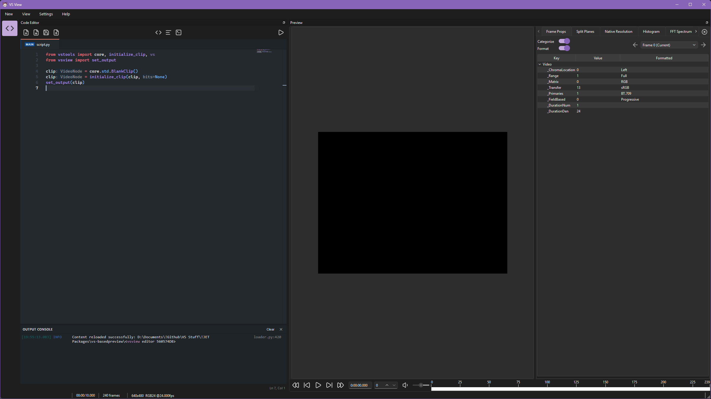

# Editor Workspace

The **Editor Workspace** embeds a Monaco-based code editor and integrated Python environment inside **VSView**.

It provides script editing, live language server diagnostics, multi-tab file management, and an execution output console alongside the video frame preview.

Refer to the [Workspaces Overview](workspace.md) for general workspace layout and viewer controls.

---

## Installation

=== "pip"
    ```bash title="Install Editor"
    pip install vsview-editor
    ```
=== "uv"
    ```bash title="Add Editor"
    uv add vsview-editor
    ```

---

## Workspace Layout

The Editor workspace consists of two main dockable panels:

1. **Code Editor Panel (Left)**: Contains the toolbar, multi-tab bar, Monaco editor viewport, output console, and status bar.
2. **Preview Stack Panel (Right)**: Displays rendered video frames and playback controls. Refer to the [Workspaces Overview](workspace.md) for general workspace layout and viewer controls.

<figure markdown="span">
    { .lightboxOn }
</figure>

---

## Toolbar Controls

The editor toolbar provides access to script management, formatting, and execution controls:

| Icon                      | Control               | Default Shortcut | Action                                                                 |
| :------------------------ | :-------------------- | :--------------- | :--------------------------------------------------------------------- |
| :lucide-file-plus:        | **New Script**        | ++ctrl+n++       | Opens a new untitled script tab (`untitled_<id>.py`).                  |
| :lucide-file-down:        | **Open Script**       | ++ctrl+o++       | Displays a file picker to open an existing script.                     |
| :lucide-save:             | **Save Script**       | ++ctrl+s++       | Saves the active tab buffer to disk.                                   |
| :lucide-file-up:          | **Save Script As...** | ++ctrl+shift+s++ | Displays a file picker to save the active buffer to a new path.        |
| :lucide-code:             | **Format Code**       | ++shift+alt+f++  | Formats the active tab code using Ruff.                                |
| :lucide-text-align-start: | **Toggle Word Wrap**  | ++alt+z++        | Toggles soft line wrapping in the editor.                              |
| :lucide-square-terminal:  | **Toggle Console**    | ++ctrl+grave++   | Shows or hides the integrated output console.                          |
| :lucide-play:             | **Run Script**        | ++f5++           | Reloads and executes the designated main script in the preview engine. |

---

## Interface Components

### Multi-Tab System

The tab bar manages open script buffers.

The execution target is identified by a `MAIN` badge on the tab. Clicking **Run Script** (++f5++) executes the `MAIN` script regardless of which tab is currently visible.

Right-click any tab and select **Set as Main Script** to designate it as the execution target.

### Monaco Editor Viewport

The code viewport is powered by [Monaco Editor](https://github.com/microsoft/monaco-editor), the same code editor that powers VS Code.

- **Autocompletion & IntelliSense**: Trigger code suggestions with ++ctrl+space++.
- **Hover & Diagnostics**: Hovering over symbols displays docstrings and type signatures. Syntax and type errors are underlined inline.
- **Peek Definition**: Peek definitions with ++ctrl+left-button++.
- **Color Themes**: Customize the editor appearance with built-in Light, Dark, High Contrast, Visual Studio, and GitHub color themes.

### Output Console

The integrated xterm.js terminal panel displays execution logs.

### Status Bar

The status bar at the bottom left of the editor dock displays the current cursor line and column position (`Ln X, Col Y`).

---

## Language Server (Basedpyright)

The workspace runs an embedded instance of the [Basedpyright Language Server](https://github.com/detachhead/basedpyright) in the background.

VapourSynth stubs are automatically generated when the workspace starts.
You can also force them to be regenerated by opening the Monaco **Show All Commands** palette with ++f1++ or ++ctrl+shift+p++,
and selecting "VapourSynth: Generate Stubs".

Like any other plugin, the language server can be configured through the **Settings** menu.

---

## Configuration Settings

The Editor workspace settings can be configured in VSView settings under the `Plugin - Editor` plugin section.
