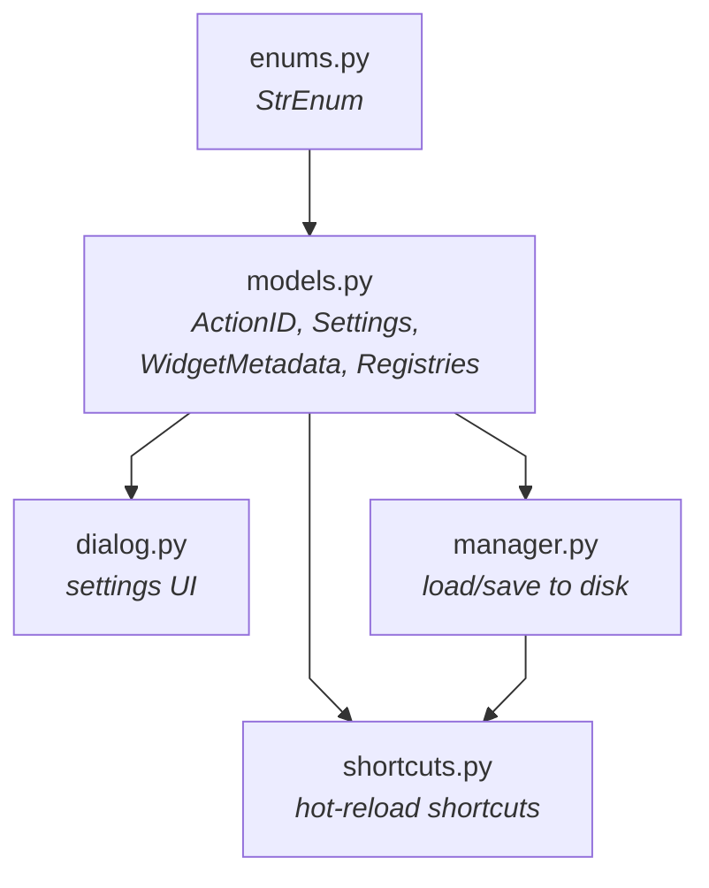

# Settings Module

**Single source of truth**: Everything is defined in `models.py`:

- Shortcuts: `ActionDefinition` objects (id, label, default key)
- Settings: Model fields use `Annotated` types with UI metadata + defaults
- Widget behavior: Each `WidgetMetadata` subclass handles its own widget creation and value handling

## Adding a Shortcut

### 1. Add ActionID (`models.py`)

```python
class ActionID(StrEnum):
    MY_ACTION = "scope.my_action", "My Action Label", "Ctrl+M"
    #             ↑ action_id        ↑ label            ↑ default key
```

### 2. Register for hot-reload

```python
from .settings import ActionID, ShortcutManager

# For QAction (e.g., menu items):
ShortcutManager.register_action(ActionID.MY_ACTION, my_action)

# For standalone shortcuts (global to a widget):
ShortcutManager.register_shortcut(ActionID.MY_ACTION, callback, parent_widget)
```

---

## Adding a Setting

Define a field with annotation and default value in a `BaseModel`.

```python
class GlobalSettings(BaseModel):
    __section__ = "General"

    my_feature: Annotated[bool, Checkbox(label="My Feature", text="Enable")] = False
```

---

## Widget Types

| Type            | Annotation Example                                                      |
| --------------- | ----------------------------------------------------------------------- |
| `Checkbox`      | `Annotated[bool, Checkbox(label="Enabled", text="Check me")]`           |
| `Dropdown`      | `Annotated[str, Dropdown(label="Mode", items=[("A", "a")])]`            |
| `Spin`          | `Annotated[int, Spin(label="Size", min=0, max=100, suffix="px")]`       |
| `DoubleSpin`    | `Annotated[float, DoubleSpin(label="Val", min=0, max=1)]`               |
| `PlainTextEdit` | `Annotated[list[float], PlainTextEdit(label="List", value_type=float)]` |
| `TimeEdit`      | `Annotated[QTime, TimeEdit(label="Interval", display_format="mm:ss")]`  |

### Value Transforms (for unit conversion)

```python
drag_timeout: Annotated[
    float,
    Spin(
        label="Timeout",
        suffix=" ms",
        to_ui=lambda v: int(v * 1000),   # seconds -> ms (display)
        from_ui=lambda v: v / 1000.0,    # ms -> seconds (storage)
)] = 0.04  # Default in seconds
```

---

## Architecture

### Module Dependencies



### File Responsibilities

| File           | Purpose                                                                                                             |
| -------------- | ------------------------------------------------------------------------------------------------------------------- |
| `enums.py`     | Shared enums used across the settings system.                                                                       |
| `models.py`    | Single source of truth. Definitions of actions, widget metadata, and Pydantic settings models.                      |
| `manager.py`   | `SettingsManager` singleton - Handles persistent storage (Global in app dir, Local in `.vsjet/`).                   |
| `shortcuts.py` | `ShortcutManager` singleton - Manages `QShortcut`/`QAction` lifecycle, hot-reloading keys, and detecting conflicts. |
| `dialog.py`    | `SettingsDialog` - Introspects models via `extract_settings` to build the UI dynamically with collapsible sections. |
